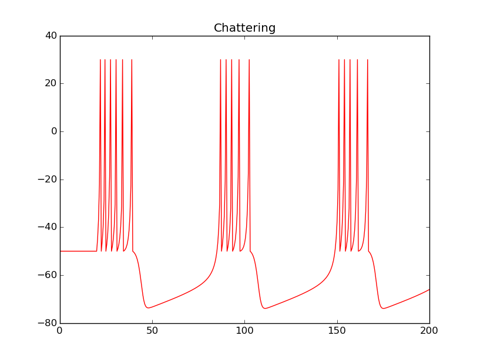

# Undergraduate computational neuroscience course project

Simulations of a simple model for neuronal spiking using Numpy.

Reference: Eugene M Izhikevich, Simple model of spiking neurons, IEEE Transactions on neural networks, vol.14, iss.6, pp.1569-1572, (2003).

Mark: 19/20 (ranked 1st).

(LaTeX/figure_10.png)
